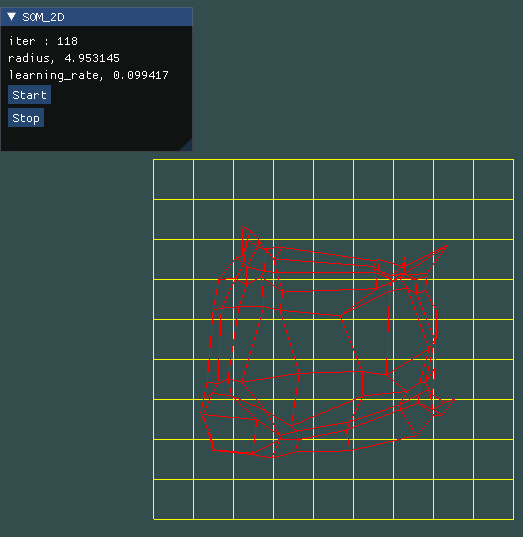

# Self-Organizing Map 2D Demo

###### 進階逐漸嘗試把網格貼到2D平面上 ######

### 初始化
* lattice是10 * 10隨機生成的網格
* inputdata標準的平面也是10*10
* 總迭代次數為20000
* 畫面
    * 左邊顯示目前的迭代次數、收縮半徑、學習比率
    * 有按鈕開始即暫停
* 繪畫
    ```
        glPolygonMode(GL_FRONT_AND_BACK,GL_LINE);
        glBindVertexArray(dataset_square_four_edges.VAO);
        glDrawArrays(GL_LINES, 0, world.dataset_square_four_edges.size());
    ```


### 開始執行




### 結果

* 最邊邊角角無法很完美的貼合 


